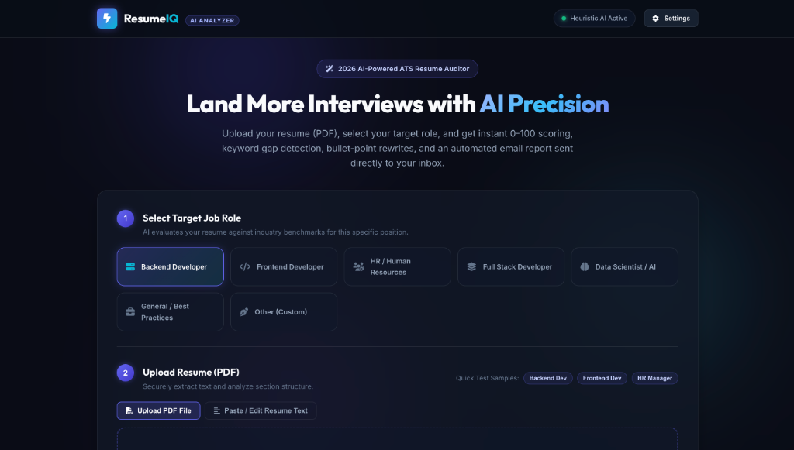

# 🚀 ResumeIQ - AI-Powered Resume Analyzer & ATS Auditor

A production-ready full-stack **Python** application for automated resume parsing, role-targeted AI scoring, ATS optimization, and email report delivery.

Built 100% in Python (Flask + Modern Vanilla CSS/HTML/JS) — completely independent of external platforms like Replit.

🌐 **Live Demo on Vercel:** [https://resume-iq-pink-six.vercel.app/](https://resume-iq-pink-six.vercel.app/)



---

## ✨ Features

- 📄 **PDF Resume Upload & Text Parser**: Secure multi-page PDF extraction with metadata detection (pages, word count, candidate email, contact phone, standard sections).
- 🎯 **Role-Targeted Evaluation**:
  - Backend Developer
  - Frontend Developer
  - HR / Human Resources
  - Full Stack Developer
  - Data Scientist / AI Engineer
  - General / Best Practices
  - Custom Role specification
- 🧠 **Multi-LLM & Heuristic Engine Support**:
  - **OpenAI** (`gpt-4o-mini` / `gpt-4o`)
  - **Google Gemini** (1.5 Flash)
  - **Built-in Intelligent Heuristic Analyzer** (runs offline with zero API key needed!)
- 📊 **Deep Evaluation Breakdown**:
  - **Overall Score (0-100)** with grade pills (*Exceptional*, *Strong*, *Needs Improvement*, *Critical*)
  - **ATS Compatibility Score**
  - **Technical Skills Alignment**
  - **Quantifiable Impact & Metrics**
  - **Structure & Formatting Quality**
- 🔍 **Gap Analysis & Recommendations**:
  - High-value missing keywords tag cloud
  - Missing section alerts
  - Actionable improvement steps
  - **High-Impact Bullet Rewrites** applying Google's **XYZ formula** (*Accomplished X as measured by Y by doing Z*)
- 📩 **Automated Email Reports**:
  - Professional, mobile-responsive HTML email report template
  - Automated delivery via **Gmail SMTP**
  - In-app **Email Preview Modal** with live rendering and test dispatching
- ⚡ **1-Click Sample Resumes**: Includes pre-built PDF resumes for Backend, Frontend, and HR roles for instant testing.

---

## 🛠️ Quick Start

### 1. Install Dependencies
```bash
pip install -r requirements.txt
```

### 2. (Optional) Configure Environment Variables
Copy `.env.example` to `.env` if you wish to configure live OpenAI / Gemini or Gmail SMTP:
```bash
cp .env.example .env
```

```env
# Optional AI API Key (Intelligent local engine runs if omitted)
OPENAI_API_KEY=sk-...

# Optional Gmail SMTP settings for real email dispatch
SMTP_EMAIL=your_email@gmail.com
SMTP_PASSWORD=your_16_char_gmail_app_password
SMTP_SERVER=smtp.gmail.com
SMTP_PORT=587
PORT=5001
```

### 3. Generate Sample PDF Resumes
```bash
python generate_samples.py
```

### 4. Run the Application
```bash
python app.py
```

Open your browser and navigate to:
```
http://127.0.0.1:5001
```

---

## 📂 Project Architecture

```
├── app.py                      # Flask REST API & Web Server
├── requirements.txt            # Python dependencies
├── generate_samples.py         # Utility to generate sample PDF resumes
├── .env.example                # Environment variables template
├── services/
│   ├── pdf_service.py          # PyPDF extraction & section parser
│   ├── ai_service.py           # Multi-LLM & Heuristic analysis engine
│   └── email_service.py        # Gmail SMTP & HTML email generator
├── templates/
│   └── index.html              # Glassmorphic single-page web UI
├── static/
│   ├── css/
│   │   └── style.css           # Modern dark-mode styling & animations
│   └── js/
│       └── app.js              # Client state, drag-drop, gauges & APIs
└── sample_resumes/             # Pre-built PDF resumes for testing
    ├── Alex_Morgan_Backend_Developer.pdf
    ├── Samantha_Lee_Frontend_Developer.pdf
    └── Elena_Vance_HR_Manager.pdf
```

---

## 🔒 Gmail App Password Setup
To send live emails with your Gmail account:
1. Go to your **Google Account** &rarr; **Security**.
2. Turn ON **2-Step Verification**.
3. Search for **App Passwords**.
4. Create an App Password (e.g. name it `ResumeIQ`).
5. Copy the 16-character password into `.env` as `SMTP_PASSWORD`.
